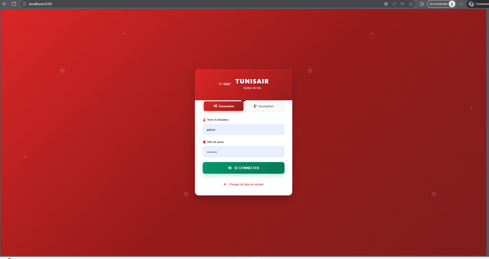
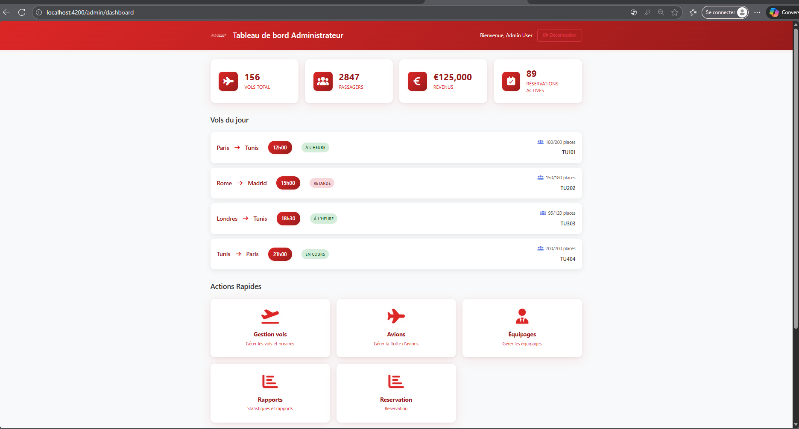
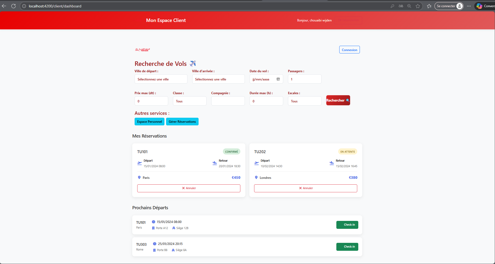

# 🎯 Gestion des Vols – Application Web de Réservation et d’Administration

Une application web complète permettant la **recherche de vols**, la **réservation**, la **gestion des paiements**, ainsi qu’un **espace administrateur** pour gérer les vols, avions, équipages et utilisateurs.  
Le projet combine **Angular** pour le frontend et **Python (Flask)** pour le backend.

---

## 🖼️ Aperçu du Design

### 📌 Interface Principale

Ajoutez ici vos captures d’écran :

  
  


> 💡 Créez un dossier `images/` dans votre repo GitHub et ajoutez-y vos captures.

---

## 🚀 Fonctionnalités

### 👤 Côté Client
- ✔️ Recherche de vols par destination, date, aller/retour  
- ✔️ Affichage détaillé des résultats  
- ✔️ Formulaire de réservation  
- ✔️ Paiement intégré  
- ✔️ Espace client avec historique des réservations  

### 🛫 Côté Administrateur
- ✔️ Tableau de bord complet  
- ✔️ Gestion des vols (CRUD)  
- ✔️ Gestion des avions  
- ✔️ Gestion des équipages  
- ✔️ Gestion des utilisateurs  
- ✔️ Gestion des réservations  
- ✔️ Génération de rapports  

---

## 🛠️ Technologies Utilisées

### 🌐 Frontend
- Angular 17  
- TypeScript  
- HTML / SCSS  
- Services & Guards  
- Angular Routing  

### 🐍 Backend
- Python  
- Flask (API REST)  
- JWT Authentication  

### 🗄️ Base de données
- MongoDB
- MongoDB compass

### 🧰 Outils
- Git & GitHub  
- Postman  
- VS Code  
- Node.js / NPM  

---

## 📦 Installation & Exécution

### 🔹 1. Cloner le projet
```bash
git clone https://github.com/Wejdenchouaibi/gestion_des_vols.git
cd gestion_des_vols
